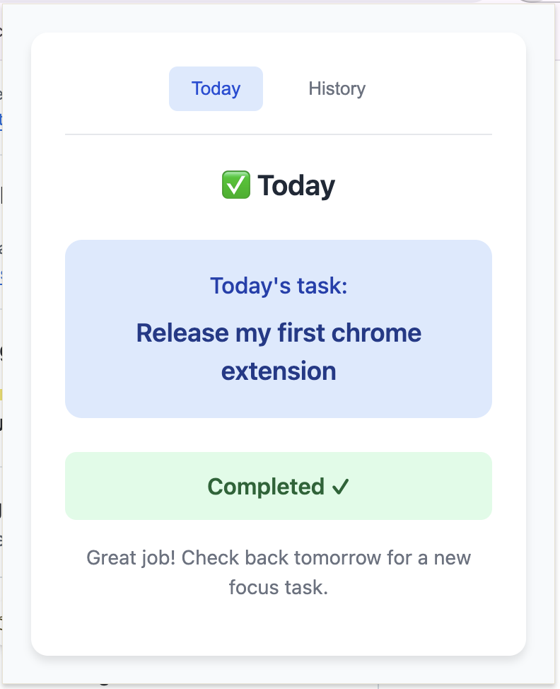
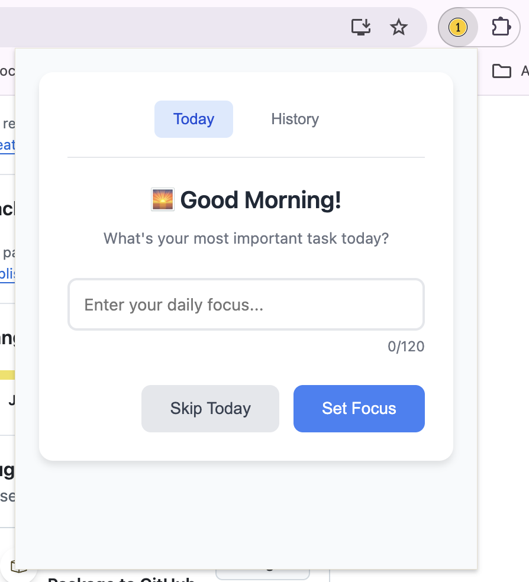
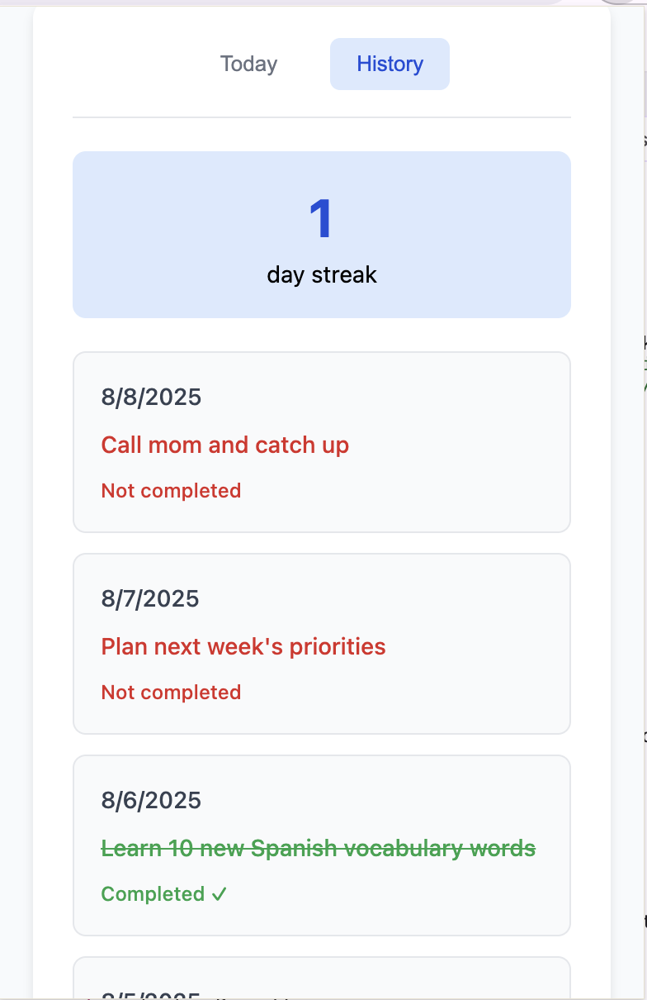

# Daily Focus - Simple Daily Goal Tracking

A minimal Chrome extension for tracking daily goals. Set one important task each day, track your progress, and build streaks.

## ✨ Features

- **Daily task**: Set one important task each day
- **Configurable notifications**: Morning, periodic reminders, and evening at times you choose
- **Active days**: Choose which days of the week count toward your streak
- **Streak counter**: Tracks consecutive active-day completions (inactive days don’t break streaks)
- **History**: Review past tasks and completion status
- **Minimal design**: Clean, distraction-free interface



## 🚀 Installation (Developer Mode)

Since this extension is not published on the Chrome Web Store, you'll need to install it in developer mode:

### Step 1: Download the Extension
1. Click the green "Code" button on this GitHub repository
2. Select "Download ZIP"
3. Extract the ZIP file to a folder on your computer

### Step 2: Enable Developer Mode in Chrome
1. Open Google Chrome
2. Go to `chrome://extensions/` (paste this in your address bar)
3. In the top-right corner, toggle on **"Developer mode"**

### Step 3: Load the Extension
1. Click the **"Load unpacked"** button that appears after enabling Developer mode
2. Navigate to and select the folder where you extracted the extension files
3. Click "Select Folder"

### Step 4: Pin the Extension (Optional)
1. Click the puzzle piece icon (🧩) in Chrome's toolbar
2. Find "Daily Focus" in the list
3. Click the pin icon to keep it visible in your toolbar

## 📖 How to Use

### Setting Your Daily Task

1. **Morning**: Click the Daily Focus extension icon
2. You'll see a "Good Morning!" view asking for your most important task
3. Enter your task (up to 120 characters)
4. Click "Set Focus" or "Skip Today" if you want to skip



### During the Day

- Click the extension icon to see your current task
- Use "Edit Task" to modify your task if needed
- Use "Complete Early" to mark it done before evening
- If enabled, you'll receive periodic reminders during the day

### Evening Reflection

- At your configured evening time, you'll get a reminder to reflect
- Click "Yes, I completed it" to mark your task as done
- This updates your streak and adds to your history

### Viewing History

1. Click the "History" tab in the extension
2. See your current streak at the top
3. Review past days showing:
   - Date
   - Task description
   - Completion status (✓ Completed, Not completed, or Skipped)




## ⚙️ Settings

- **Times**: Choose your morning and evening notification times.
- **Reminders**: Set a reminder interval in minutes; reminders pause on inactive days or after you complete/skip the task.
- **Active days**: Toggle which days count. Inactive days:
  - won't trigger morning/evening notifications
  - won't schedule reminders
  - don't break your streak

## 🎯 Usage Tips

- **Keep it simple**: Choose one important, achievable task per day
- **Be specific**: Instead of "work on project," try "complete project outline"
- **Track consistently**: Even small wins count toward your streak
- **Skip when needed**: It's better to skip than set unrealistic goals

## 🔧 Technical Details

- **Permissions**: `storage`, `notifications`, `alarms`
- **Data storage**: All data is stored locally in your browser
- **Offline**: Works completely offline

## 📊 Data Privacy

- All your task data is stored locally in your browser
- No data is sent to external servers
- No tracking or analytics
- Your privacy is completely protected

## 🛠️ Development

### Local Development Setup

1. Clone this repository:
   ```bash
   git clone https://github.com/mikisegall/one-thing-chrome-extension.git
   cd one-thing-chrome-extension
   ```

2. Load the extension in Chrome (follow installation steps above)

3. Make changes to the code

4. Go to `chrome://extensions/` and click the refresh icon on the Daily Focus extension to reload your changes

### File Structure

```
daily-focus-extension/
├── manifest.json       # Extension configuration
├── popup.html         # Main popup interface
├── popup.js          # Popup functionality
├── background.js     # Background service worker
├── icon.png         # Extension icon
└── README.md        # This file
```

## 🤝 Contributing

Contributions are welcome! Please feel free to submit a Pull Request. For major changes, please open an issue first to discuss what you would like to change.

## 🐛 Issues & Support

If you encounter any issues or have suggestions:

1. Check the [Issues](https://github.com/mikisegall/one-thing-chrome-extension/issues) page
2. Create a new issue if your problem isn't already listed
3. Include details about your Chrome version and what you were trying to do

---

**Made with ❤️ for productivity and focus** 
